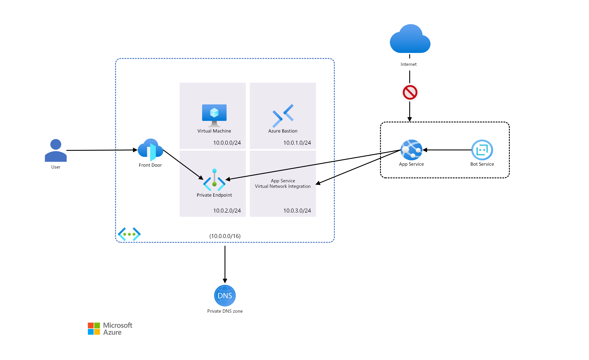

# Azure Bot in a Virtual Network with Front Door

The repository enables easy deployment of an Azure Bot (basic EchoBot) into a Virtual Network made publicly accessible via Azure Front Door.

The architecture includes the following components:

Virtual Network that uses space 10.0.0.0/16 contains 4 subnets:
    - DefaultSubnet (10.0.0.0/24)
    - AzureBastionSubnet (10.0.1.0/24)
    - PrivateEndpointSubnet (10.0.2.0/24)
    - AppServiceIntegrationSubnet (10.0.3.0/24)
- A VM and Bastion host serving as a jumpbox for secure operations within the virtual network.
- A virtual network integrated App Service running a basic Echo Bot with associated App Service Plan.
- A Private Endpoint that enables private network connectivity to the App Service.
- A Private DNS Zone with records that ensure the App Service domain resolves to the Private Endpoint's IP address.
- A Front Door with Private Link enabled connection to the App Service.
- A Bot Channel Registration configured with Front Door's messaging endpoint.

## Deployment

### Update Environment Variables

- Rename `sample.env` to `.env` and add values for the following variables:

| Enviromment Variable    |  Description                           |
| ------------------------| -------------------------------------- |
| PREFIX                  | Value to be prefixed to all resources  |
| LOCATION                | Location for all resources             |
| ADMIN_USERNAME          | Username to connect to jumpbox VM      |
| ADMIN_PASSWORD          | Password to connect to jumpbox VM      |

### Run the Deployment Script

- Open the root directory in bash
- Login to Azure - `az login`
- Run the deployment script - `./scripts/deploy.sh`

## Testing the Solution

### Ensure Bot is Publicly Inaccessible

- Navigate to the Azure Portal and find the newly created resource group
- Select the Azure App Service resource and click "Browse"
- Observe the 403 response

Alternatively, you can attempt to connect to the App Service's messaging endpoint via the Bot Framework Emulator and observe the same behavior.

### Ensure Bot is Privately Accessible

- Navigate to the Azure Portal and find the newly created resource group
- Select the Virtual Network resource and find the "Bastion" blade
- Enter your username and password used in Terraform parameters to connect to Bastion
- Open Powershell within the jumpbox
- Observe that the App Services domain name resolves to the correct IP address for the Private Endpoint - `nslookup ${APP_SERVICE_DOMAIN_NAME}`

### Ensure Bot is Accessible Via Microsoft Teams

- Navigate to the Azure Portal and find the newly created resource group
- Select the Bot resource and find the "Channels" blade
- Find Microsoft Teams and click "Open in Teams"
- Chat with the bot

Alternatively, you can communicate with the bot via WebChat.

## Extending the Solution

### Additional Bot Channel Registrations

The bot is available via Direct Line, Web Chat, and Microsoft Teams, but can be extended to additional channels by adding other [Terraform AzureRM bot channel resources](https://registry.terraform.io/providers/hashicorp/azurerm/latest/docs/resources/bot_channel_facebook), like the existing [`azurerm_bot_channel_ms_teams` resource](./infra/main.tf).

### Azure Front Door WAF Security Policies

Azure Front Door has a built-in Web Application Firewall (WAF). [Custom WAF rules](https://learn.microsoft.com/azure/web-application-firewall/afds/waf-front-door-custom-rules) can be applied to Azure Front Door and can be used to ensure traffic is only accepted from certain channels, like Microsoft Teams.